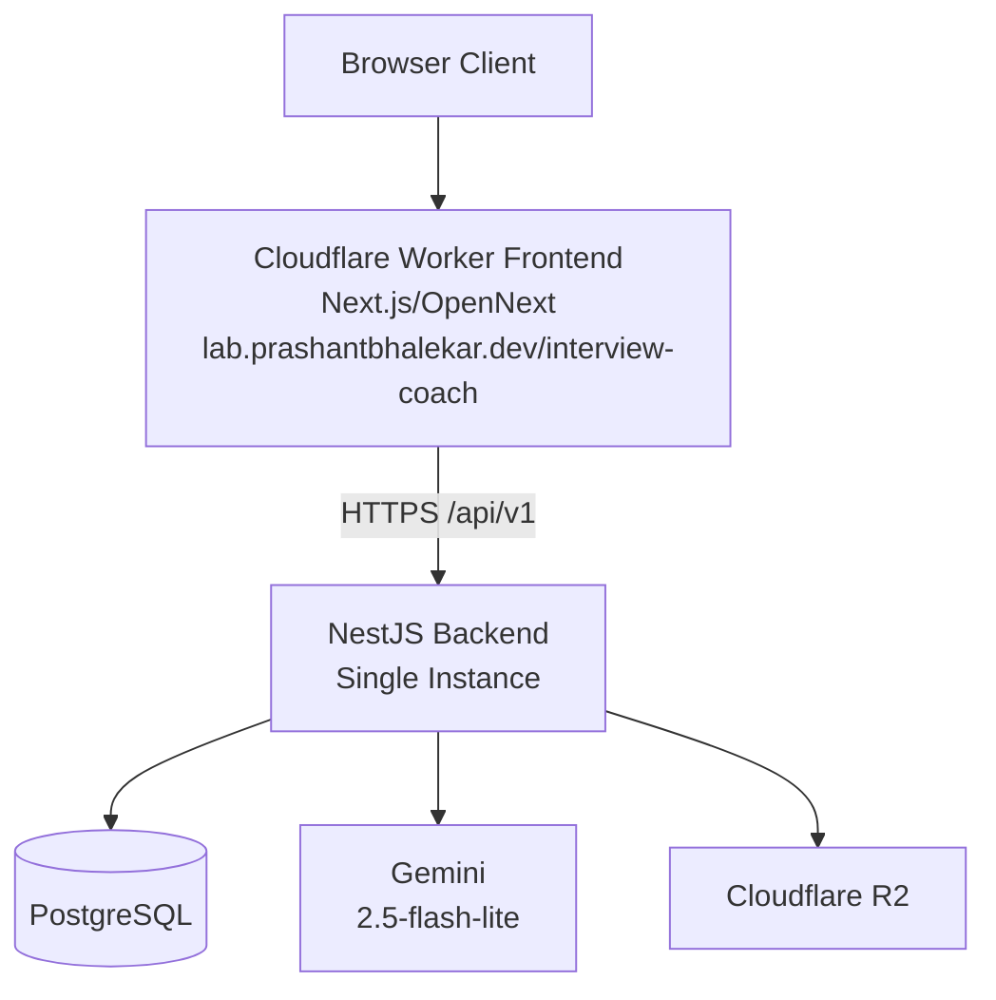
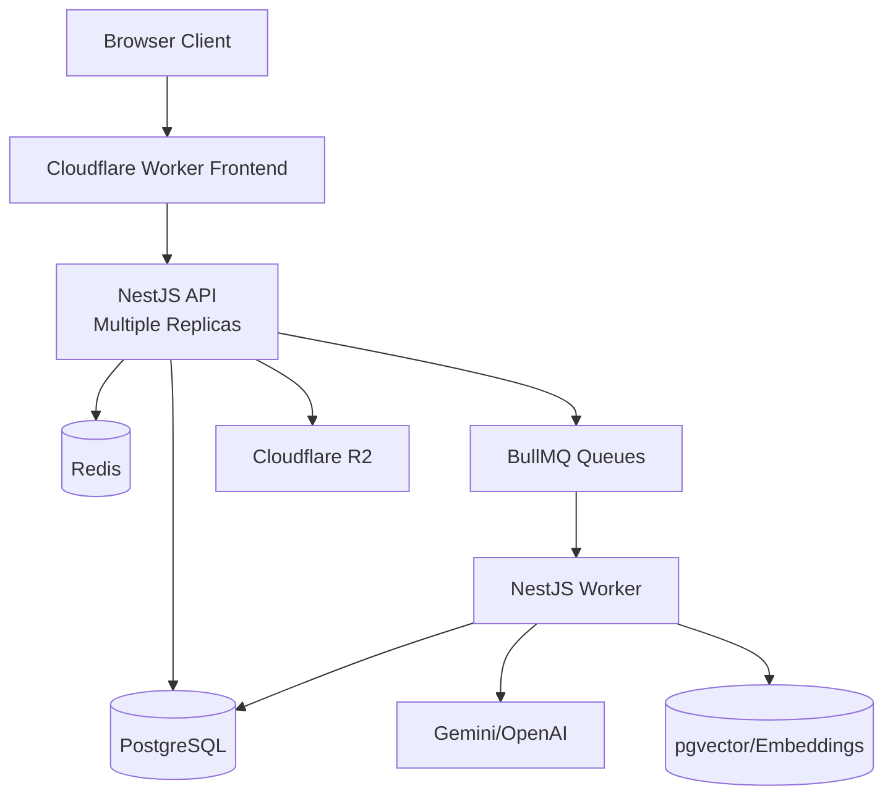

# Phase 1 Production Architecture (Source of Truth)

Date: 2026-10-02
Status: Active
Owners: Backend + Platform

## A) Project Overview

AI Interview Coach is a monorepo application for resume-based interview preparation:

1. User authentication and profile
2. Resume upload and storage
3. AI resume analysis
4. AI-assisted interview question generation
5. Interview answer evaluation and final scoring

Current target is cost-conscious Phase 1 production with clean upgrade path to Phase 2 scale architecture.

## B) Current Monorepo Architecture

- apps/frontend: Next.js application
- apps/backend: NestJS API (`/api/v1/*`)
- apps/worker: NestJS BullMQ worker (kept for Phase 2)
- packages/shared-types: shared package
- docker/*: container build files

## C) Phase 1 Architecture

Phase 1 is single-backend, synchronous AI processing, no Redis/BullMQ requirement.

## D) Phase 2 Architecture

Phase 2 enables async processing, distributed scaling, queueing, and optional RAG.

## E) Request Flow

1. Browser requests frontend route under `/interview-coach/*`
2. Frontend sends API calls to backend `/api/v1/*`
3. Backend validates/authenticates request
4. Backend executes business logic and persistence
5. Backend calls AI provider for required AI operations
6. Backend returns typed response JSON

## F) Authentication Flow

1. User calls `/api/v1/auth/register` or `/api/v1/auth/login`
2. Backend validates DTO and credentials
3. Password hash validation via bcrypt
4. JWT returned by backend
5. Authenticated requests use JWT bearer token

## G) Resume Upload/Storage Flow

1. Frontend uploads PDF via `/api/v1/resumes/upload`
2. Backend validates file type and size
3. StorageService uploads to selected storage driver (`local` or `r2`)
4. Resume metadata persisted in PostgreSQL
5. Phase 1 (queue disabled): resume status transitions directly to `COMPLETED`
6. Phase 2 (queue enabled): resume status transitions to `QUEUED` and worker processes

## H) Resume Analysis Flow

### Phase 1 (active)

1. `POST /api/v1/ai/resume-analysis`
2. Backend validates payload
3. AiService invokes configured AI provider synchronously
4. Structured response validated with schema
5. Usage metrics persisted
6. Response returned immediately

### Phase 2 (future)

1. API can enqueue analysis job (optional mode)
2. Worker processes AI call and stores result
3. Frontend reads job status/result endpoints

## I) Interview/Question Generation Flow

1. Frontend starts interview session (`/api/v1/interviews/sessions`)
2. Backend requests AI-generated questions via AiService
3. If AI fails, deterministic fallback questions are used
4. Session and questions persisted in PostgreSQL

## J) Answer Evaluation Flow

1. Frontend posts answer to `/api/v1/interviews/sessions/:id/answers`
2. Backend scores answer using deterministic scoring logic
3. Backend updates interview evaluation aggregate
4. Frontend retrieves final result via `/api/v1/interviews/sessions/:id/results`

## K) Current Synchronous Processing Flow

Current production-default processing is synchronous for AI analysis endpoints.
No Redis/BullMQ/worker is required in this flow.

## L) Future Asynchronous BullMQ Flow

BullMQ architecture remains in codebase and is enabled by config:

1. Enable Redis + queue flags
2. API enqueues queue jobs
3. Worker consumes jobs
4. API exposes status/result retrieval

## M) Database Architecture

- Primary DB: PostgreSQL
- ORM: Prisma
- Production migration command: `prisma migrate deploy`
- Core entities: users, resumes, AI usage, interview sessions/questions/answers/evaluations, embedding docs/chunks

## N) Redis Architecture

### Phase 1

- Redis disabled by default (`REDIS_ENABLED=false`)
- Backend startup does not require Redis URL
- Readiness reports Redis as `disabled`

### Phase 2

- Redis enabled (`REDIS_ENABLED=true`)
- Redis URL required
- Used for BullMQ, distributed cache, distributed rate limiting

## O) AI Provider Architecture

- Provider abstraction retained
- Supported providers: Gemini, OpenAI, Ollama
- Provider selected by `AI_PROVIDER`
- Conditional credential validation by selected provider

## P) Storage Architecture

- Storage abstraction via StorageService
- Drivers: `local`, `r2`
- Phase 1 production target: `r2`
- Local driver is development/non-durable

## Q) Frontend Architecture

- Next.js app under `/interview-coach`
- API base URL configured via `NEXT_PUBLIC_API_BASE_URL`
- No direct browser-to-Gemini credential usage

## R) Backend Architecture

- NestJS modular backend with global env validation
- API namespace remains `/api/v1/*`
- Security baseline: validation pipes, security headers, CORS origin config

## S) Worker Architecture

- `apps/worker` remains present for Phase 2
- Requires Redis + DB env to run
- Not deployed in Phase 1

## T) Environment Variables (Grouped)

### Core

- NODE_ENV
- PORT
- DATABASE_URL
- JWT_SECRET
- FRONTEND_URL

### Feature toggles

- REDIS_ENABLED
- QUEUE_ENABLED
- CACHE_ENABLED
- RATE_LIMIT_ENABLED
- RATE_LIMIT_STORE (`memory`|`redis`)
- EMBEDDINGS_ENABLED
- RAG_ENABLED

### AI

- AI_PROVIDER
- GEMINI_API_KEY / GEMINI_MODEL / GEMINI_REQUEST_TIMEOUT_MS
- OPENAI_API_KEY / OPENAI_MODEL
- OLLAMA_BASE_URL / OLLAMA_MODEL

### Storage

- STORAGE_DRIVER (`local`|`r2`)
- STORAGE_LOCAL_BASE_PATH
- R2_ACCOUNT_ID / R2_ACCESS_KEY_ID / R2_SECRET_ACCESS_KEY / R2_BUCKET / R2_ENDPOINT

### Worker

- WORKER_CONCURRENCY
- EMBEDDING_CHUNK_TARGET_CHARS
- EMBEDDING_CHUNK_OVERLAP_CHARS

## U) Required in Phase 1

- DATABASE_URL
- JWT_SECRET
- FRONTEND_URL
- AI_PROVIDER=gemini
- GEMINI_API_KEY
- GEMINI_MODEL
- STORAGE_DRIVER=r2 (production)
- R2_ACCOUNT_ID
- R2_ACCESS_KEY_ID
- R2_SECRET_ACCESS_KEY
- R2_BUCKET

## V) Disabled/Optional in Phase 1

- REDIS_ENABLED=false
- QUEUE_ENABLED=false
- CACHE_ENABLED=false
- EMBEDDINGS_ENABLED=false
- RAG_ENABLED=false
- REDIS_URL optional when Redis disabled
- OPENAI_API_KEY not required unless `AI_PROVIDER=openai`
- OLLAMA_* not required in production

## W) Required in Phase 2

- REDIS_ENABLED=true
- REDIS_URL
- QUEUE_ENABLED=true
- CACHE_ENABLED=true (if Redis cache enabled)
- RATE_LIMIT_STORE=redis (when distributed limiting enabled)
- EMBEDDINGS_ENABLED=true
- RAG_ENABLED=true
- Worker deployment enabled
- Optional OpenAI credentials only if provider switched to OpenAI

## X) Infrastructure Required in Phase 1

1. Frontend deployment platform: Cloudflare Workers/OpenNext
2. Backend runtime: single NestJS container/service
3. PostgreSQL managed database
4. Cloudflare R2 bucket
5. Gemini API access

## Y) Infrastructure Intentionally NOT Deployed in Phase 1

1. Redis / ElastiCache
2. BullMQ queue processors
3. Separate worker service
4. pgvector setup
5. Embedding generation pipelines
6. RAG retrieval pipelines
7. Distributed cache
8. Distributed rate limiting
9. Multi-replica backend scaling
10. OpenAI production provider (optional future)
11. Production Ollama

## Z) Infrastructure Required in Phase 2

1. Redis
2. BullMQ queue pipelines
3. Worker deployment
4. Multi-replica backend scaling
5. Optional pgvector + embeddings + RAG components

## AA) Deployment Flow

Phase 1 deployment order:

1. Deploy backend (single instance)
2. Validate `/api/v1/health` and `/api/v1/health/readiness`
3. Deploy frontend
4. Run end-to-end smoke tests

## AB) CI/CD Flow

Current baseline:

- CI workflow runs lint, typecheck, test, build
- Deployment workflows can be added separately for frontend/backend

## AC) Health/Readiness Flow

- Liveness: `/api/v1/health`
- Readiness: `/api/v1/health/readiness`

Phase behavior:

- Phase 1: DB required, Redis reported `disabled` when off
- Phase 2: DB + Redis required when Redis enabled

## AD) Security Considerations

1. Strict DTO validation and schema checks
2. Password hashing in auth flow
3. CORS bound to configured frontend origin
4. Security headers enabled
5. Provider credentials remain backend-only
6. Do not log API keys/passwords/tokens
7. Avoid logging raw sensitive resume content

## AE) Scaling Path

1. Keep Phase 1 single instance
2. Add Redis and queue in Phase 2
3. Deploy worker separately
4. Scale backend/worker independently
5. Add distributed rate limiting and cache

## AF) Rollback Considerations

1. Keep immutable image tags
2. Rollback backend to prior task/image
3. Rollback frontend worker deployment
4. For DB migration issues: use backup/snapshot restore protocol

## AG) Cost-Control Considerations

1. Disable Redis/BullMQ in Phase 1
2. Keep single backend instance
3. Use synchronous request path
4. Avoid pgvector/embeddings infra until needed
5. Prefer Gemini flash-lite model for lower cost

## AH) Migration Checklist (Phase 1 → Phase 2)

1. Provision Redis
2. Set `REDIS_ENABLED=true` and `REDIS_URL`
3. Set `QUEUE_ENABLED=true`
4. Deploy worker service
5. Turn on queue-based processing paths
6. Set `CACHE_ENABLED=true`
7. Set `RATE_LIMIT_STORE=redis`
8. Enable embeddings/RAG flags
9. Apply any schema migrations for embeddings/pgvector
10. Validate queue throughput and readiness behavior

## AI) Exact Steps to Enable Redis/BullMQ Later

1. Provision Redis endpoint
2. Update backend env:

- REDIS_ENABLED=true
- REDIS_URL=redis://...
- QUEUE_ENABLED=true

3. Deploy backend with new env
4. Deploy `apps/worker` with REDIS_URL + DATABASE_URL
5. Run queue smoke checks and monitor failed jobs

## AJ) Exact Steps to Enable Embeddings/pgvector Later

1. Enable DB extension/migrations for pgvector strategy (if adopted)
2. Update backend env:

- EMBEDDINGS_ENABLED=true
- RAG_ENABLED=true (when retrieval pipeline is ready)

3. Enable queue and worker deployment
4. Validate chunk creation and embedding processing jobs
5. Validate retrieval quality and fallback behavior

## AK) Exact Steps to Enable Distributed Rate Limiting Later

1. Ensure Redis is enabled and reachable
2. Update env:

- RATE_LIMIT_ENABLED=true
- RATE_LIMIT_STORE=redis

3. Add Redis-backed implementation in guard/service
4. Load test for multi-instance fairness and limits
5. Roll out gradually with monitoring

## Feature Matrix (Phase 1 vs Phase 2)

| Feature                   | Phase 1      | Phase 2  |
| ------------------------- | ------------ | -------- |
| PostgreSQL                | ENABLED      | ENABLED  |
| Gemini                    | ENABLED      | ENABLED  |
| R2                        | ENABLED      | ENABLED  |
| JWT auth                  | ENABLED      | ENABLED  |
| Redis                     | DISABLED     | ENABLED  |
| BullMQ                    | DISABLED     | ENABLED  |
| NestJS Worker             | NOT DEPLOYED | DEPLOYED |
| Async resume analysis     | DISABLED     | ENABLED  |
| Redis cache               | DISABLED     | ENABLED  |
| Distributed rate limiting | DISABLED     | ENABLED  |
| pgvector                  | DISABLED     | ENABLED  |
| Embeddings                | DISABLED     | ENABLED  |
| RAG                       | DISABLED     | ENABLED  |
| OpenAI                    | DISABLED     | OPTIONAL |
| Ollama production         | DISABLED     | OPTIONAL |
| Multiple backend replicas | DISABLED     | ENABLED  |
| Advanced observability    | BASIC        | ENABLED  |
| Usage/token tracking      | BASIC        | ENABLED  |

## Environment Variables by Phase

| Variable           | Phase 1          | Phase 2          | Required when            |
| ------------------ | ---------------- | ---------------- | ------------------------ |
| DATABASE_URL       | Required         | Required         | Always                   |
| JWT_SECRET         | Required         | Required         | Always                   |
| FRONTEND_URL       | Required         | Required         | Always                   |
| AI_PROVIDER        | Required         | Required         | Always                   |
| GEMINI_API_KEY     | Required         | Required         | `AI_PROVIDER=gemini`     |
| GEMINI_MODEL       | Required         | Required         | `AI_PROVIDER=gemini`     |
| STORAGE_DRIVER     | Required         | Required         | Always                   |
| R2_*               | Required in prod | Required in prod | `STORAGE_DRIVER=r2`      |
| REDIS_ENABLED      | false            | true             | Phase toggle             |
| REDIS_URL          | Optional         | Required         | `REDIS_ENABLED=true`     |
| QUEUE_ENABLED      | false            | true             | Phase toggle             |
| CACHE_ENABLED      | false            | true             | Phase toggle             |
| RATE_LIMIT_ENABLED | true             | true             | Feature toggle           |
| RATE_LIMIT_STORE   | memory           | redis            | Phase 2 distributed mode |
| EMBEDDINGS_ENABLED | false            | true             | Phase toggle             |
| RAG_ENABLED        | false            | true             | Phase toggle             |
| OPENAI_API_KEY     | Not required     | Optional         | `AI_PROVIDER=openai`     |
| OLLAMA_*           | Local only       | Optional         | `AI_PROVIDER=ollama`     |

## Architecture Decision Records

1. Redis disabled in Phase 1 to reduce infrastructure cost/complexity for single-instance MVP.
2. BullMQ disabled in Phase 1 to avoid queue+worker operational overhead.
3. R2 is preferred for production durability; local filesystem is non-durable for production containers.
4. Gemini is selected for production with provider abstraction retained for future flexibility.
5. pgvector/embeddings are deferred to avoid premature complexity before RAG need is proven.
6. Single backend instance is intentional for cost control in controlled rollout.
